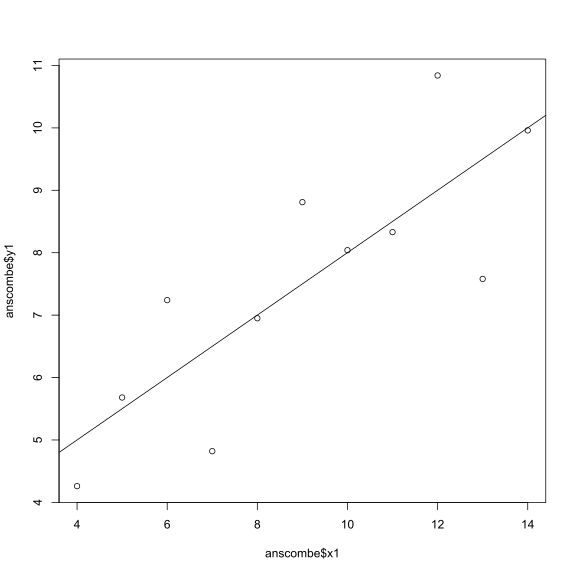
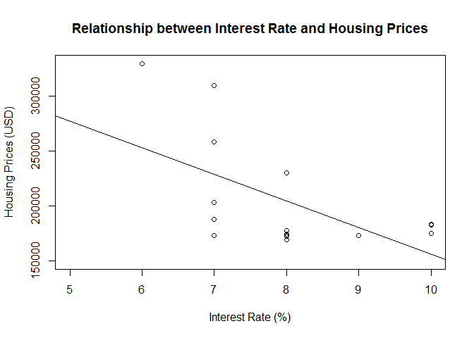
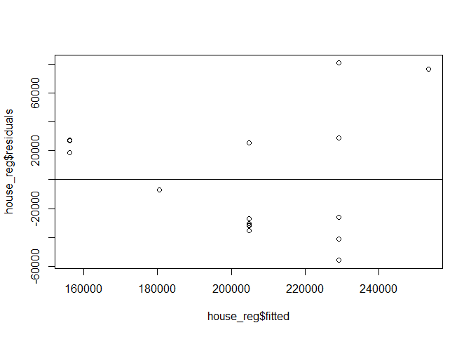
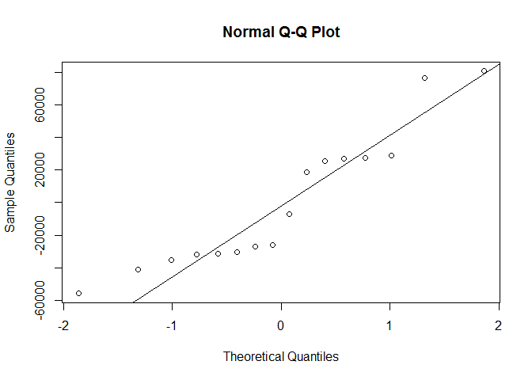

Stats Assignments (1-6)
================
Carmen Roberts

Hello Octocat
-------------

I love Octocat. She's the coolest cat in town.


Anscombe Dataset
----------------

    ## [1] 11  8

    ## [1] "x1" "x2" "x3" "x4" "y1" "y2" "y3" "y4"

    ##   x1 x2 x3 x4   y1   y2    y3   y4
    ## 1 10 10 10  8 8.04 9.14  7.46 6.58
    ## 2  8  8  8  8 6.95 8.14  6.77 5.76
    ## 3 13 13 13  8 7.58 8.74 12.74 7.71
    ## 4  9  9  9  8 8.81 8.77  7.11 8.84
    ## 5 11 11 11  8 8.33 9.26  7.81 8.47
    ## 6 14 14 14  8 9.96 8.10  8.84 7.04

    ##    x1 x2 x3 x4    y1   y2   y3    y4
    ## 6  14 14 14  8  9.96 8.10 8.84  7.04
    ## 7   6  6  6  8  7.24 6.13 6.08  5.25
    ## 8   4  4  4 19  4.26 3.10 5.39 12.50
    ## 9  12 12 12  8 10.84 9.13 8.15  5.56
    ## 10  7  7  7  8  4.82 7.26 6.42  7.91
    ## 11  5  5  5  8  5.68 4.74 5.73  6.89

    ##        x1             x2             x3             x4    
    ##  Min.   : 4.0   Min.   : 4.0   Min.   : 4.0   Min.   : 8  
    ##  1st Qu.: 6.5   1st Qu.: 6.5   1st Qu.: 6.5   1st Qu.: 8  
    ##  Median : 9.0   Median : 9.0   Median : 9.0   Median : 8  
    ##  Mean   : 9.0   Mean   : 9.0   Mean   : 9.0   Mean   : 9  
    ##  3rd Qu.:11.5   3rd Qu.:11.5   3rd Qu.:11.5   3rd Qu.: 8  
    ##  Max.   :14.0   Max.   :14.0   Max.   :14.0   Max.   :19  
    ##        y1               y2              y3              y4        
    ##  Min.   : 4.260   Min.   :3.100   Min.   : 5.39   Min.   : 5.250  
    ##  1st Qu.: 6.315   1st Qu.:6.695   1st Qu.: 6.25   1st Qu.: 6.170  
    ##  Median : 7.580   Median :8.140   Median : 7.11   Median : 7.040  
    ##  Mean   : 7.501   Mean   :7.501   Mean   : 7.50   Mean   : 7.501  
    ##  3rd Qu.: 8.570   3rd Qu.:8.950   3rd Qu.: 7.98   3rd Qu.: 8.190  
    ##  Max.   :10.840   Max.   :9.260   Max.   :12.74   Max.   :12.500

``` r
data("anscombe")            # indicate that you are using the dataset "anscombe" 
plot(anscombe$x1, anscombe$y1)        #plotting scatter plot of columns x1 and y1
abline(lm(y1 ~ x1, data = anscombe))  #adding abline showing linear regression
```



Analgesic Dataset
-----------------

    ## [1] 40  5

    ## [1] "ID"            "Group"         "Measurement_1" "Measurement_2"
    ## [5] "Measurement_3"

    ##   ID     Group Measurement_1 Measurement_2 Measurement_3
    ## 1  1 Analgesic            26            26            21
    ## 2  2 Analgesic            29            26            23
    ## 3  3 Analgesic            24            28            22
    ## 4  4 Analgesic            25            22            24
    ## 5  5 Analgesic            24            28            23
    ## 6  6 Analgesic            22            23            26

    ##    ID   Group Measurement_1 Measurement_2 Measurement_3
    ## 35 35 Placebo            17            21            15
    ## 36 36 Placebo            19            17            15
    ## 37 37 Placebo            14            19            13
    ## 38 38 Placebo            17            19            13
    ## 39 39 Placebo            11            20            18
    ## 40 40 Placebo            15            18            12

    ##        ID              Group    Measurement_1   Measurement_2 
    ##  Min.   : 1.00   Analgesic:20   Min.   :10.00   Min.   : 8.0  
    ##  1st Qu.:10.75   Placebo  :20   1st Qu.:17.00   1st Qu.:17.0  
    ##  Median :20.50                  Median :20.00   Median :20.0  
    ##  Mean   :20.50                  Mean   :20.12   Mean   :20.7  
    ##  3rd Qu.:30.25                  3rd Qu.:24.00   3rd Qu.:25.0  
    ##  Max.   :40.00                  Max.   :30.00   Max.   :32.0  
    ##  Measurement_3  
    ##  Min.   :12.00  
    ##  1st Qu.:16.00  
    ##  Median :20.50  
    ##  Mean   :20.52  
    ##  3rd Qu.:24.25  
    ##  Max.   :30.00

    ## 
    ## Attaching package: 'dplyr'

    ## The following objects are masked from 'package:stats':
    ## 
    ##     filter, lag

    ## The following objects are masked from 'package:base':
    ## 
    ##     intersect, setdiff, setequal, union

    ## Source: local data frame [40 x 2]
    ## 
    ##       ID  mean(n)
    ##    (int)    (dbl)
    ## 1      1 24.33333
    ## 2      2 26.00000
    ## 3      3 24.66667
    ## 4      4 23.66667
    ## 5      5 25.00000
    ## 6      6 23.66667
    ## 7      7 26.66667
    ## 8      8 23.33333
    ## 9      9 22.66667
    ## 10    10 24.00000
    ## ..   ...      ...

Chicken Weights
---------------

**Null Hypothesis:** Chicken feed does not have an effect on the growth of chickens

**Alternative Hypothesis:** Chicken feed does have an effect on growth of chickens

**Assumptions:** For an unpaired parametric data set, a one-way ANOVA is required to test the hypothesis.

``` r
df_chicken <- read.csv("chick-weights.csv")             #import data set
boxplot(weight ~ feed, data = df_chicken)               #create boxplot
```


``` r
chicken_anova <- aov(weight ~ feed, data = df_chicken)  #one-way ANOVA 
summary(chicken_anova)                                  #summay statistics
```

    ##             Df Sum Sq Mean Sq F value   Pr(>F)    
    ## feed         5 231129   46226   15.37 5.94e-10 ***
    ## Residuals   65 195556    3009                     
    ## ---
    ## Signif. codes:  0 '***' 0.001 '**' 0.01 '*' 0.05 '.' 0.1 ' ' 1

p-value = 5.94e-10 ; F-value = 15.37

**Conclusions:**

The p-value is smaller than the F-value, therefore we reject the null hypothesis. We can therefore conclude that chicken feed does have an effect on chicken weights.

The Hot Zone
------------

**Null Hypothesis:** The contamination of the drinking water did not cause the gastroenteritis outbreak

**Alternative Hypothesis:** The contamination of the drinking water did cause the gastroenteritis outbreak

**Assumptions:** For an unpaired, non-parametric and categorical data set, a Fishers exact test will be used to test the hypothesis.

Significance interval set at 95%, reject the null hypothesis if p&lt;0.05.

``` r
df_gastro <- read.csv("gastroenteritis.csv")                #import data set
df_table <- table(df_gastro$Consumption, df_gastro$Outcome) #create table
df_table                                                    #print the table
```

    ##                     
    ##                      ill not ill
    ##   < 1 glasses/day     39     121
    ##   > 4 glasses/day    265     146
    ##   1 to 4 glasses/day 265     258

``` r
hot_test <- fisher.test(df_table)     #Fisher's test to test hypothesis
print(hot_test)                       #print the table
```

    ## 
    ##  Fisher's Exact Test for Count Data
    ## 
    ## data:  df_table
    ## p-value < 2.2e-16
    ## alternative hypothesis: two.sided

p-value = 2.2e-16

**Conclusions:**

p&lt;0.05, therefore we reject our null hypothesis.We conclude that the contamination caused severe gastroenteritis.

Nausea
------

**Null Hypothesis:** The 5HT3-receptor blocker does not reduce nausea in breast cancer patients receiving chemotherapy

**Alternative Hypothesis:** The 5HT3-receptor blocker does reduce nausea in breast cancer patients receiving chemotherapy

**Assumptions** Data is paired, parametric and ordinal. Wilcox rank-sum test is required to test the hypothesis.

Significance interval set at 95%, reject null hypothesis if p&lt;0.05.

    ##   Nausea_before Nausea_after
    ## 1             3            2
    ## 2             4            0
    ## 3             6            1
    ## 4             2            3
    ## 5             2            1
    ## 6             4            1
    ## 7             5            0


    ## 
    ##  Wilcoxon signed rank test with continuity correction
    ## 
    ## data:  nausea_new$Nausea_before and nausea_new$Nausea_after
    ## V = 26, p-value = 0.04983
    ## alternative hypothesis: true location shift is not equal to 0

p-value = 0.04983

**Conclusions:**

p&lt;0.04, therefore we reject our null hypothesis. We conclude that the 5HT3-receptor blocker does reduce nausea in breast cancer patients receiving chemotherapy.

Housing Prices
--------------

**Null Hypothesis:** The interest rate does not affect the housing prices

**Alternative Hypothesis:** The interest rate does affect the housing prices

**Assumptions for Pearson's Correlation:** Interest rate and housing price (USD) are on an interval scale. There are no outliers. The variables (Interest Rate and Housing Prices) are normally distributed.

**Assumptions for Linear Regression:** There is a linear trend between Interest Rate and Housing Prices. The obsevartions are independent and Interest Rate is measured without error. The residuals are nomally distributed and they have the same variance for all fitted values of y. The residuals is homoskedastic.

``` r
library(tidyr)
library(dplyr)

#Import dataset
df_houses <- read.csv("housing-prices.csv")

#Plot the data
plot(df_houses$interest_rate, df_houses$median_house_price_USD, 
     main = "Relationship between Interest Rate and Housing Prices",
     xlab = "Interest Rate (%)",
     ylab = "Housing Prices (USD)",
     xlim = c(5,10), ylim = c(150000,330000))

#Pearson's Correlation test
house_test <- with(df_houses, cor.test(x = interest_rate, y = median_house_price_USD, method = 'pearson'))
house_test 
```

    ## 
    ##  Pearson's product-moment correlation
    ## 
    ## data:  interest_rate and median_house_price_USD
    ## t = -2.6409, df = 14, p-value = 0.01937
    ## alternative hypothesis: true correlation is not equal to 0
    ## 95 percent confidence interval:
    ##  -0.8339619 -0.1133269
    ## sample estimates:
    ##        cor 
    ## -0.5766386

``` r
#Linear Regression
house_reg <- lm(median_house_price_USD~interest_rate, data = df_houses)

#Add linear regression line
abline(house_reg)
```



``` r
#Check for Homoskedasticity
homo_house <- plot(x = house_reg$fitted, y = house_reg$residuals) 
abline(h = 0)
```



``` r
#Check for Gaussian residual distribution/ normality                    
qqnorm(house_reg$residuals)
qqline(house_reg$residuals) 
```



``` r
#Summary of data
summary(house_reg)
```

    ## 
    ## Call:
    ## lm(formula = median_house_price_USD ~ interest_rate, data = df_houses)
    ## 
    ## Residuals:
    ##    Min     1Q Median     3Q    Max 
    ## -55865 -31631 -16406  27212  80735 
    ## 
    ## Coefficients:
    ##               Estimate Std. Error t value Pr(>|t|)    
    ## (Intercept)     399229      74427   5.364 9.99e-05 ***
    ## interest_rate   -24309       9205  -2.641   0.0194 *  
    ## ---
    ## Signif. codes:  0 '***' 0.001 '**' 0.01 '*' 0.05 '.' 0.1 ' ' 1
    ## 
    ## Residual standard error: 43180 on 14 degrees of freedom
    ##   (1 observation deleted due to missingness)
    ## Multiple R-squared:  0.3325, Adjusted R-squared:  0.2848 
    ## F-statistic: 6.974 on 1 and 14 DF,  p-value: 0.01937

r = -0.4458286

**Conclusion:**

Therefore we reject our null hypothesis. We conclude that high interest rates is associated with low housing prices.

The residuals are normally distributed as their distribution fits on the normal Q-Q plot.

The residuals are homoskedastic as they show spread around the zero abline.
